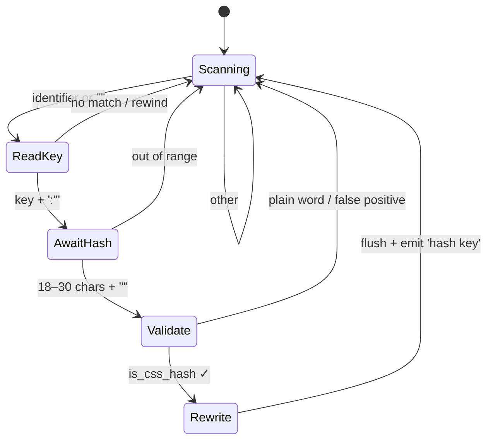

# reclass

An incredibly performant, independent utility tool that un-obfuscates minified class names on-the-fly. This tool is particularly useful for creating stable, future proof themes.

This tool is entirely plugin loader agnostic, and supports both the Steam deck and client.

Before:
```html
<div class="_27qasW5wLU4h4nUgawpo1q"></div>
```
After:
```html
<div class="_27qasW5wLU4h4nUgawpo1q FocusNavigationRoot"></div>
```

## High level abstraction



## DFA Diagram


## Performance

`reclass` implements a linear-time lexical transducer over a byte stream. It uses a greedy, left-anchored PEG recognize with a single bounded lookahead rewind, scanning for two token patterns defined by the grammar:
```
pattern  ::= quoted_key | bare_key
quoted_key ::= '"' key_q '"' ':"' hash '"'
bare_key   ::= key_b ':"' hash '"'
key_q    ::= [a-zA-Z_][a-zA-Z0-9_-]*
key_b    ::= [a-zA-Z_][a-zA-Z0-9_]*
hash     ::= [a-zA-Z0-9_-]{18,30}
```

## Building

Build reclass (Linux)

```bash
$ make
```

Build and install reclass (Linux)

```bash
$ make install
```

Cross-compile for Windows from Linux (requires `mingw-w64-gcc`)

```bash
$ make cross
```

On Arch Linux, install the cross-compiler with:

```bash
$ sudo pacman -S mingw-w64-gcc
```

## Third party libraries

* [libsnare.h](https://github.com/shdwmtr/libsnare.h) - A c/cxx/asm compatible single-header hooking library for x86/x64/arm64. inline hooks and PLT/IAT hooks. linux/windows/macos.
