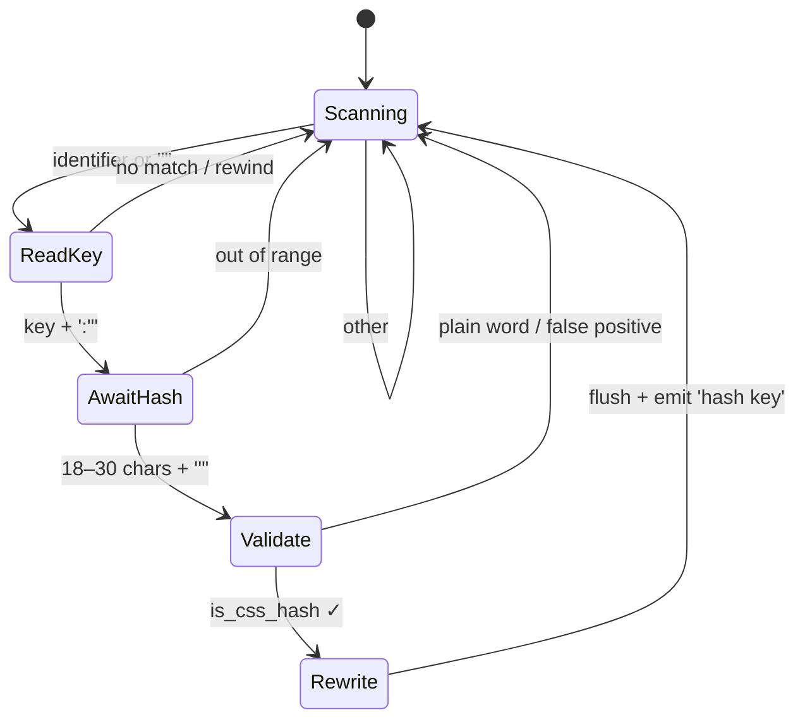

# Resident

**RES**tore Steam's internal class **IDENT**ifiers.

An incredibly small, performant, independent utility tool that un-obfuscates minified class names in Steams CEF on-the-fly. This tool is particularly useful for creating stable, future proof themes.

This tool is entirely plugin loader agnostic, and supports both the Steam deck and client.

```diff
diff --git a/tmp/before.html b/tmp/after.html
index ec676a2..1ca47d7 100644
--- a/tmp/before.html
+++ b/tmp/after.html
@@ -1,17 +1,17 @@
-<div class="_1rDh5rXSFZJOqCa4UpnI4z" style="position: relative;">
+<div class="_1rDh5rXSFZJOqCa4UpnI4z ContentFrame" style="position: relative;">
```

# Parser

<table>
<tr>
<td width="50%">



</td>
<td width="50%">

</td>
</tr>
</table>

`resident` implements a linear-time lexical transducer over a byte stream. It uses a greedy, left-anchored PEG recognize with a single bounded lookahead rewind, scanning for two token patterns defined by the grammar:
```
pattern  ::= quoted_key | bare_key
quoted_key ::= '"' key_q '"' ':"' hash '"'
bare_key   ::= key_b ':"' hash '"'
key_q    ::= [a-zA-Z_][a-zA-Z0-9_-]*
key_b    ::= [a-zA-Z_][a-zA-Z0-9_]*
hash     ::= [a-zA-Z0-9_-]{18,30}
```
# Benchmarks

These are benchmarks are the average patch time over 100 runs on an Intel i9-14900k.
In fact; this libraries server is an order of magnitude faster than Steams inbuilt loopback. 
On startup, Steam reads ALL files from steamui/ linearly, (seemingly) no chunking
and caches them in page cache. With this library, steam *forcefully* misses `chunk~*.js` when initially caching.
This leads to faster, less resourceful startup (measured to be about 3 seconds on my machine).

This is why Millennium moved themes outside of steamui/ as any very deep directories with alot of individual reads (.git, node_modules/ etc) cause the CPU to panic
under L3 cache pressure, making startup sometimes 15,20, or even n seconds (linearly) slower depending on your setup. 


# Accuracy & Reliability

The patcher cannot generate invalid syntax, it's fully rulled out of the language. It *technically* can produce runtime errors by modifying strings that 
aren't in class modules, but the parameters are very strict - this likely won't happen. 

# Hooking

## Windows

Hooking relies on DLL lookup path hijacking. The **steamwebhelper.exe** *links* **version.dll** (meaning the wloader loads version.dll into the process before `main()/__constructor__()`) for version utilities. 
**version.dll** is officially shipped with Windows as a builtin system component, in System32. Historically, **version.dll** was never made a [**KnownDLL**](https://learn.microsoft.com/en-us/windows/win32/dlls/dynamic-link-library-search-order) for security reasons (debated), meaning
when wloader calls LoadLibrary on **version.dll**, it will actually try to look it up in the cwd instead of System32 directly. This means we can create a *fake* **version.dll** whenever the **steamwebhelper.exe** lives, and if we export its IAT symbol table to the real **version.dll**
from System32, we have internal memory access to steams webhelper. From there we setup the hooks documented below. 

## Unix

Same idea as Windows, but using an X11 dependency the hijack target. `libXtst.so.6` is always loaded by the webhelper which is spawned under Steams pressure vessel. The pressure vessel points `LD_LIBRARY_PATH` to a container at `~/.steam/steam/ubuntu12_32/`. 
However, their library path specifications aren't tight enough. We can sneak in a shim at `~/.steam/steam/ubuntu12_64/libXtst.so.6`, take precedence over `~/.steam/steam/ubuntu12_32/steam-runtime/amd64/usr/lib/x86_64-linux-gnu/libXtst.so.6` in search path resolution, `HOOK_FUNC` to pipe calls back to the original, and an `__attribute__((constructor))` to setup the hooks documented below. 

```mermaid
flowchart LR
    S[steam.exe] --> W[Starts steamwebhelper.exe]
    W --> K[Requests version.dll\nchecks KnownDLLs registry key]
    K --> N[Not listed in KnownDLLs\nfalls back to standard search order]
    N --> A[Loader loads our ./version.dll]
    A --> R[Re-exports real version.dll exports]
    R --> SW[steamwebhelper.exe runs]

    A --> CT[constructor runs\ninstall_hook]
    CT --> DL[dl_iterate_phdr\nfinds cef_browser_host_create_browser\nin libcef.so]
    DL --> IN[snare_inline_new\npatches bytes at cef fn entry\nto redirect to tramp_]

    SW --> CEF[CEF calls\ncef_browser_host_create_browser\nclient, url, settings...]
    IN --> CEF

    CEF --> TR[tramp_ intercepts\ncef_browser_host_create_browser]
    TR --> PH[Patches client vtable\nclient->get_request_handler\n-> hooked_get_request_handler]
    PH --> OC[Calls original\ncef_browser_host_create_browser\nvia snare trampoline]
    OC --> SW

    SW --> GRQ[CEF calls\nclient->get_request_handler]
    GRQ --> HRQ[hooked_get_request_handler\ncalls original get_request_handler\ngets Steam's cef_request_handler_t]
    HRQ --> PRQ[Patches returned handler\nhandler->get_resource_request_handler\n-> hooked_get_resource]
    PRQ --> RH[Returns modified\ncef_request_handler_t to CEF]

    RH --> GRES[CEF calls\nget_resource_request_handler\nwith cef_request_t]
    GRES --> HRS[hooked_get_resource\nreads request->get_url]
    HRS --> CHK{chunk~*.js\n+ has local file?}
    CHK -->|No| PASS[Calls orig_get_resource\nreturns Steam's handler]
    CHK -->|Yes| DROP[Disposes Steam's handler\nif it returned one]
    DROP --> CUST[Returns custom\nsteamloopback_request_handler_t\nwith resident read callbacks]
```



# Building

All build instructions assume the host is linux. It compiles fine on windows, I just don't have docs for it. 

```bash
# build resident
$ make

# permanently install resident into steam
$ make install

# Cross-compile for Windows from Linux (requires `mingw-w64-gcc`)
$ make cross
```

On Arch Linux, install the cross-compiler with:

```bash
$ sudo pacman -S mingw-w64-gcc
```

# Third party libraries

[libsnare.h](https://github.com/shdwmtr/libsnare.h) 

My c/cxx/asm compatible single-header hooking library for x86/x64/arm64. inline hooks and PLT/IAT hooks. linux/windows/macos.
